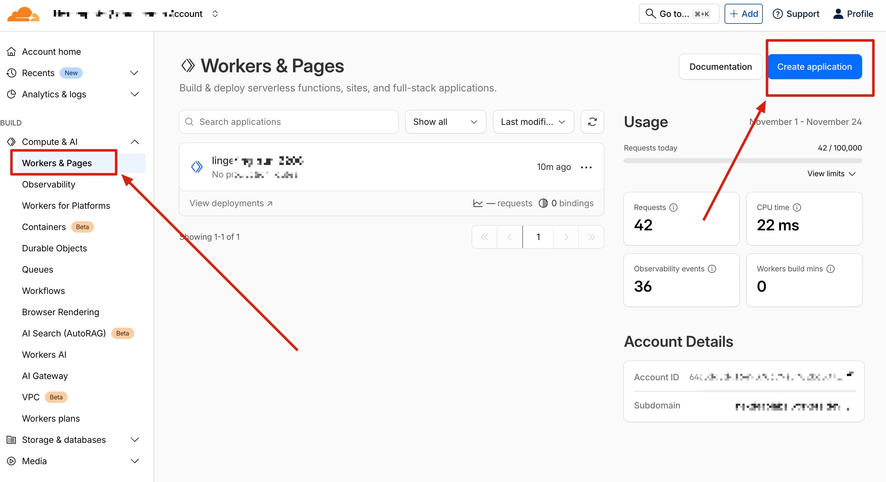
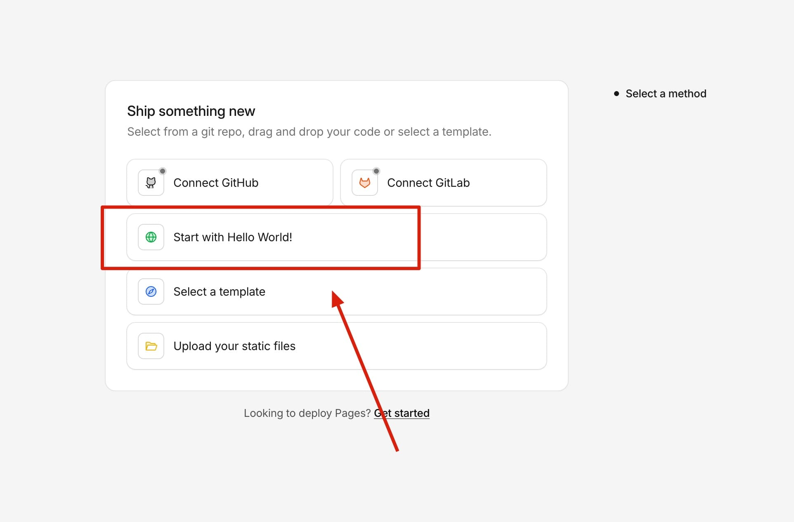
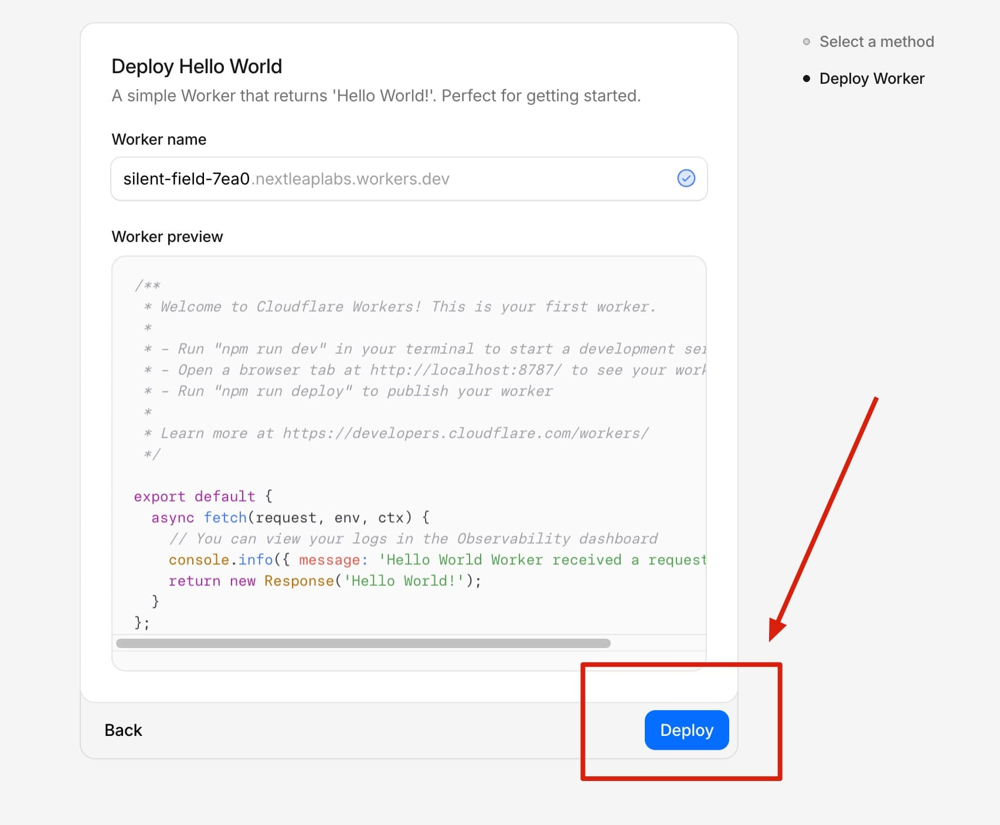
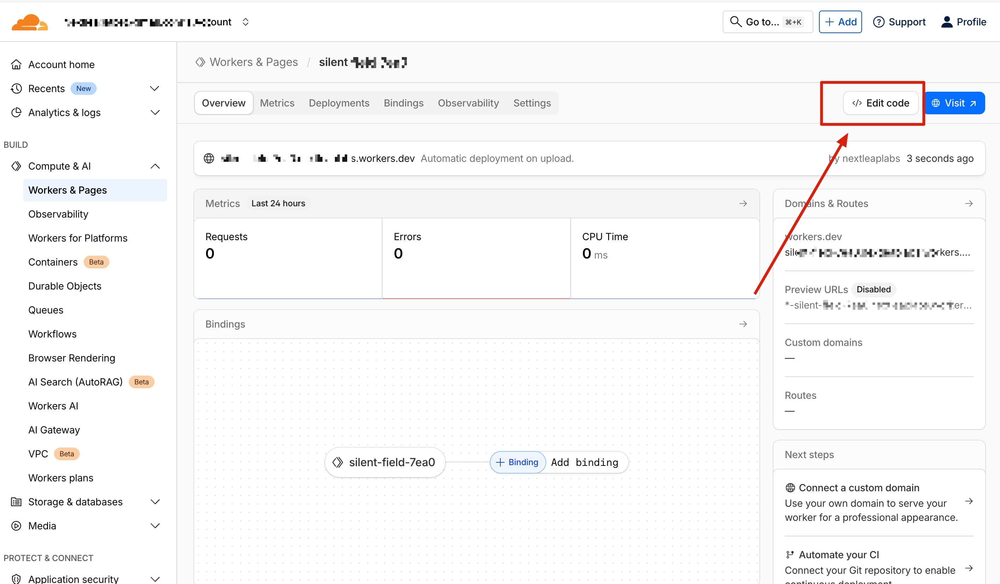
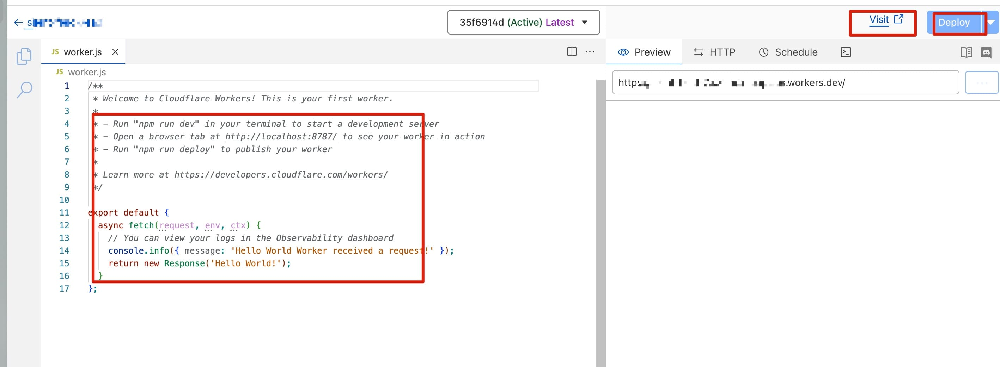
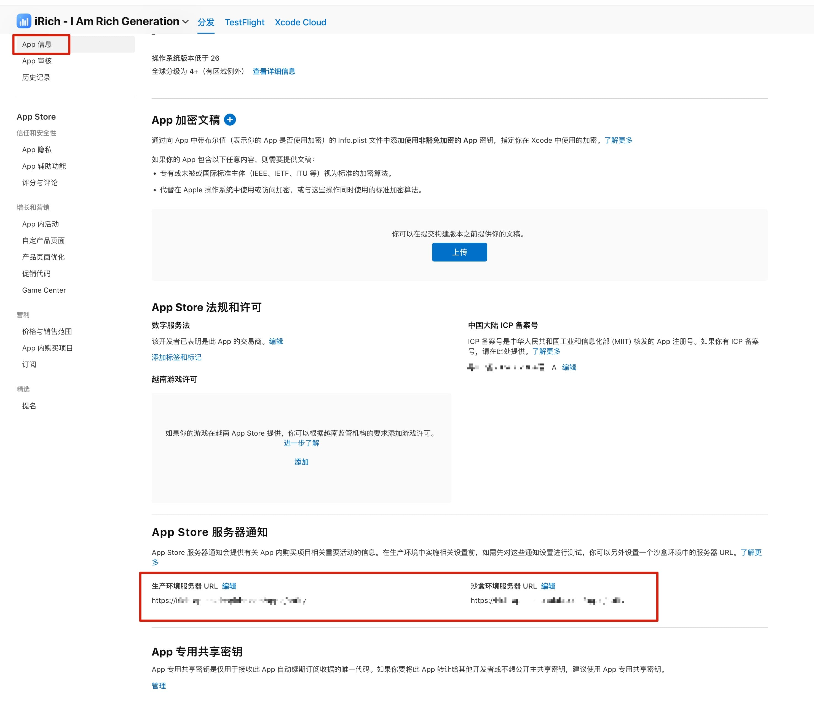
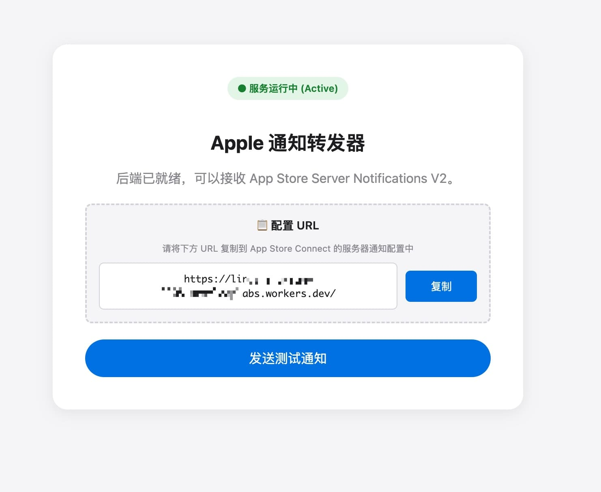
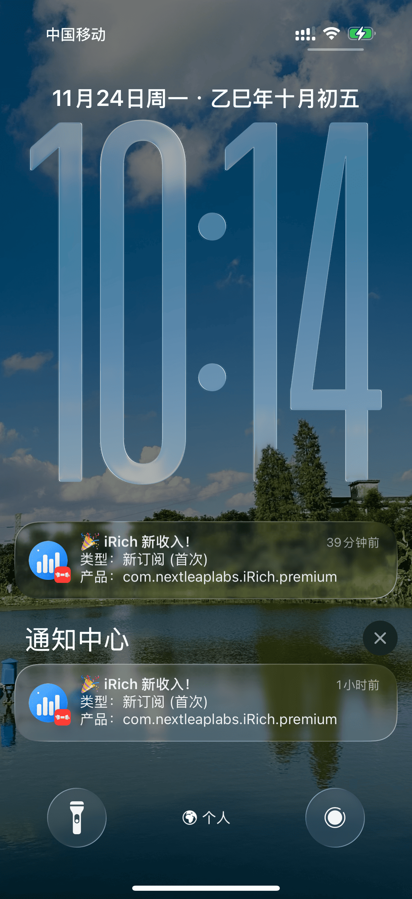

# RevenueBell 🔔

**RevenueBell** 是一个轻量级的 Cloudflare Worker 脚本，专门用于接收 Apple App Store Server Notifications V2 并实时推送收入通知到你的手机（通过 Bark）。

每当用户在你的 iOS/macOS 应用中产生订阅、续订、购买等收入事件时，RevenueBell 会立即将通知发送到你的设备，让你第一时间掌握应用收入动态。


## 🚀 快速开始

### 前置要求

1. **Cloudflare 账号**（免费）：https://dash.cloudflare.com/sign-up
2. **Bark App**（免费）：从 App Store 下载 Bark，获取推送 Key
   - App Store 链接：https://apps.apple.com/cn/app/bark/id1403753865
   - 打开 Bark 后，会显示类似 `yirE82xxxxxxxxxxxx` 的 Key

### 部署步骤

#### 通过 Cloudflare Dashboard（推荐新手）

1. **登录 Cloudflare Dashboard**
   - 访问：https://dash.cloudflare.com/
   - 选择 `Workers & Pages` → `Create application` → `Create Worker`

   

2. **创建 Worker**
   - 选择 `Start with Hello World!`

   

   - 给 Worker 命名（如 `revenuebell`）
   - 点击 `Deploy` 创建

   

3. **部署代码**
   - 点击 `Edit code` 按钮

   

   - 将 `wpush.js` 的全部内容复制粘贴到编辑器中（替换所有默认代码）
   - 点击右上角 `Deploy` 按钮

   

4. **配置环境变量**（推荐）
   - 回到 Worker 详情页，点击 `Settings` → `Variables`
   - 添加环境变量：
     ```
     BARK_KEY = 你的Bark推送Key
     ```
   - 点击 `Save and Deploy`

5. **修改配置**（如果不使用环境变量）
   - 编辑代码中的配置区域（第 7-9 行）：
   ```javascript
   const PRODUCT_NAME = "你的产品名称";  // 修改为你的应用名
   const BARK_KEY = "你的Bark推送Key";   // 替换为你的 Key
   const BARK_ICON = "你的应用图标URL";   // （可选）替换为你的图标
   ```

### 获取 Worker URL

部署成功后，你会得到一个类似这样的 URL：
```
https://revenuebell.你的用户名.workers.dev
```

## 🔧 配置 App Store Connect

1. **登录 App Store Connect**
   - 访问：https://appstoreconnect.apple.com/

2. **配置服务器通知 URL**
   - 进入 `App 信息` → `App Store 服务器通知`
   - 将你的 Worker URL 粘贴到 `生产服务器 URL` 和 `沙盒服务器 URL`
   - 选择通知版本：`Version 2`

   

3. **保存配置**
   - 点击保存后，Apple 会向你的 URL 发送测试请求

## 🧪 测试通知

### 使用内置测试页面

1. 在浏览器中访问你的 Worker URL（如 `https://revenuebell.你的用户名.workers.dev`）
2. 页面会显示一个测试界面
3. 点击 `发送测试通知` 按钮
4. 检查你的 iPhone/Mac 是否收到 Bark 通知




## 📱 通知效果

成功配置后，你会收到类似这样的通知：



## 🔍 查看日志

在 Cloudflare Dashboard 中：
1. 进入你的 Worker
2. 点击 `Logs` → `Begin log stream`
3. 实时查看所有请求和处理日志

## 🛠️ 自定义配置

### 修改产品名称

编辑 `wpush.js` 第 7 行：
```javascript
const PRODUCT_NAME = "你的产品名称";
```

### 修改通知图标

编辑 `wpush.js` 第 9 行：
```javascript
const BARK_ICON = "https://your-icon-url.com/icon.png";
```


## 🙏 致谢

- [Bark](https://github.com/Finb/Bark) - 优秀的 iOS 推送工具
- [Cloudflare Workers](https://workers.cloudflare.com/) - 强大的边缘计算平台

